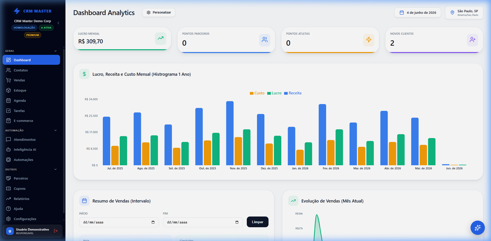
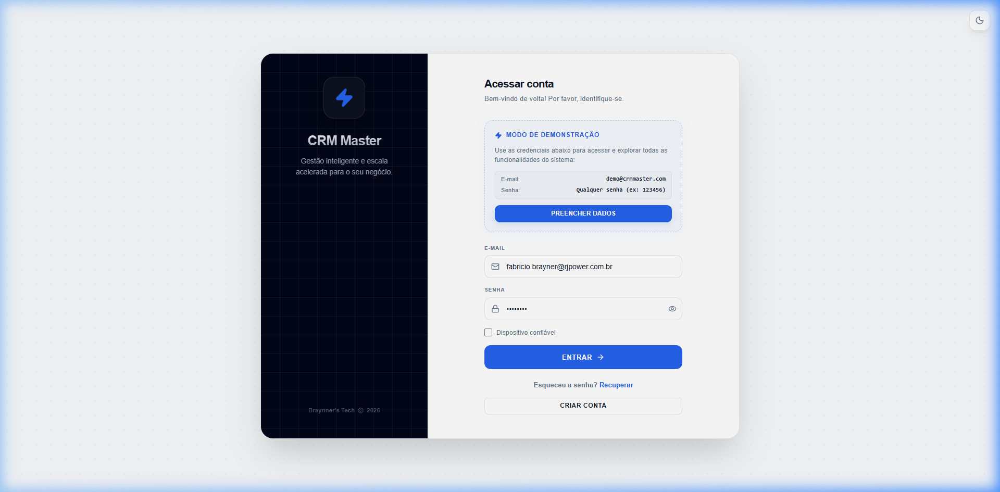
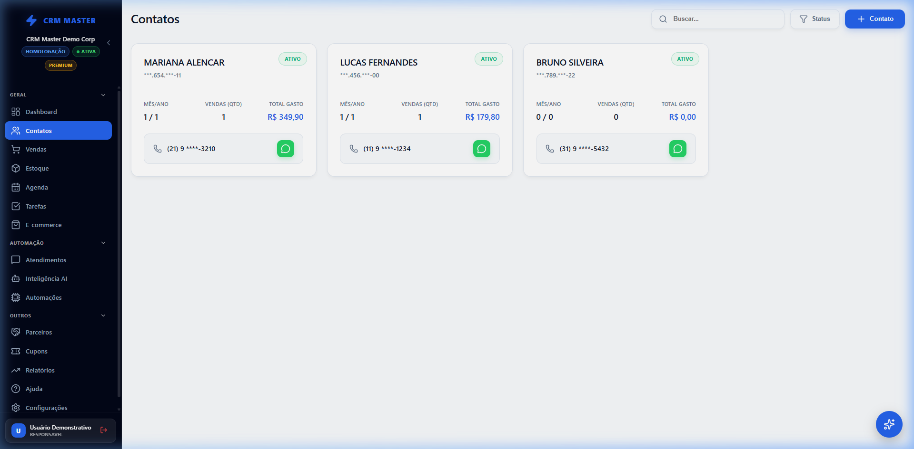
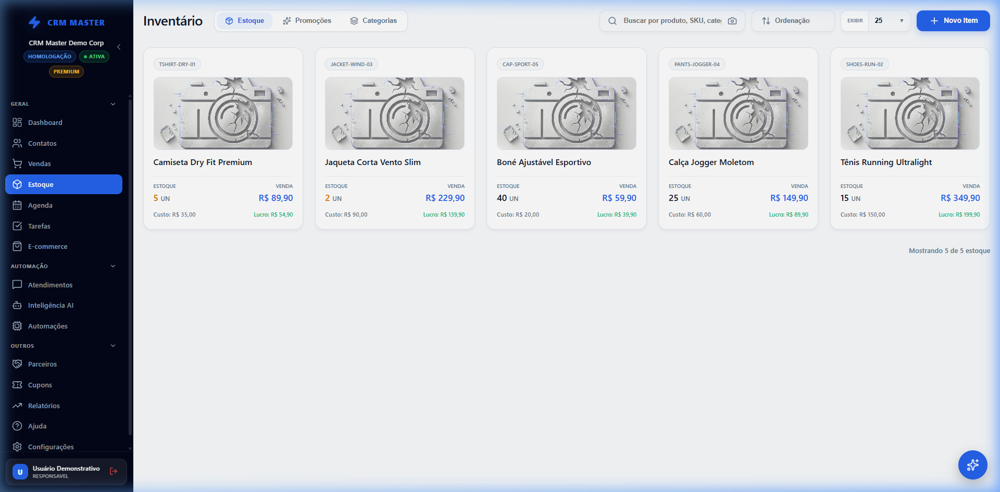
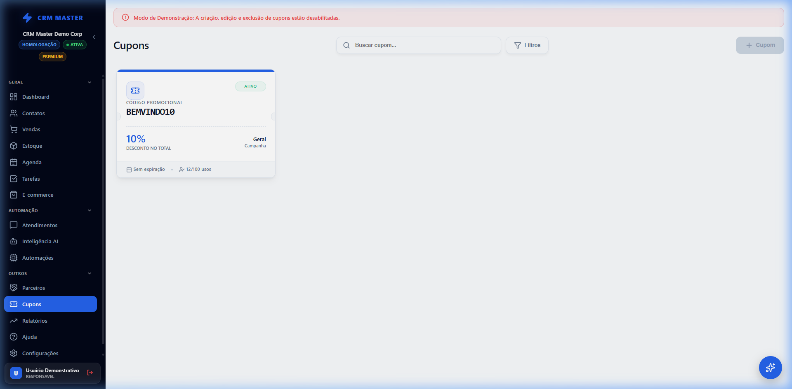
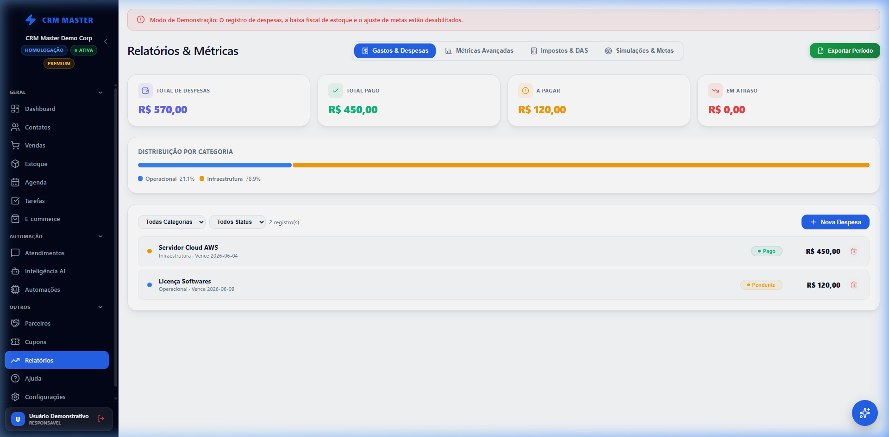
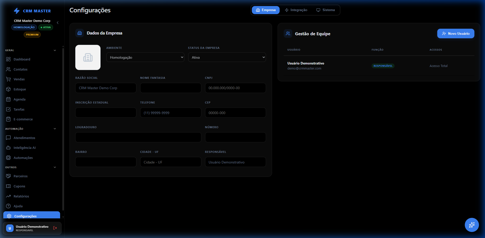

# ⚡ CRM Master

O **CRM Master** é uma plataforma de gestão de relacionamento com o cliente (CRM) premium, moderna e inteligente, desenvolvida para acelerar a escala de vendas e simplificar a administração do seu negócio. Com uma interface moderna que suporta múltiplos temas (Clean, Dark, Dim, Midnight e High Contrast) e micro-interações fluidas, o sistema oferece controle total sobre vendas, faturamento, equipe e estoque.

🔗 **[CLIQUE AQUI PARA VER A DEMONSTRAÇÃO ONLINE (LIVE DEMO)](https://brayner-ghost.github.io/CRM-Master---Demo/)**

---

## 📸 Imagens do Projeto

Aqui está uma prévia visual da plataforma nas suas diferentes interfaces e temas:

### 🖥️ Dashboard Principal (Tema Clean/Padrão)
O dashboard centraliza os indicadores de saúde financeira da sua empresa, pontuação de parceiros, vendas e novos clientes em tempo real.


---

### 🔑 Tela de Acesso e Modo de Demonstração
Tela de login segura, com transições suaves e um painel interativo de preenchimento automático para acesso de demonstração.


---

### 👥 Gestão de Clientes e Contatos
Visualização organizada da base de clientes com filtros por plano, status de ativos e históricos detalhados.


---

### 📦 Controle de Estoque
Acompanhe os produtos cadastrados, preço de venda, custo, quantidade disponível e a margem de lucro por item de forma clara.


---

### 🧾 Cupons, Notas e Vendas
Módulo de emissão de cupons fiscais e relatórios simplificados de faturamento e cupons ativos.


---

### 📊 Relatórios e Analytics
Visualização gráfica do crescimento financeiro, comparativo de planos ativos, distribuição de vendas e estatísticas consolidadas.


---

### ⚙️ Painel de Configurações (Tema Midnight)
Visualização do módulo de configurações com o tema Midnight ativado. Customize os dados da empresa, gerencie as permissões e integre a sua equipe.


---

## 🔌 Integrações Inteligentes

O CRM Master foi projetado para trabalhar perfeitamente integrado às principais soluções do mercado, automatizando processos operacionais essenciais:

*   **FocusNFE**: Emissão e controle automático de Notas Fiscais Eletrônicas (NFS-e / NFC-e) integrado diretamente aos pedidos de venda.
*   **PagBank**: Conciliação automática de maquininhas de cartão, geração de PIX dinâmico diretamente no PDV e sincronização de saldo.
*   **InfinityPay**: Links de pagamento instantâneos gerados diretamente no perfil da venda com suporte a checkout transparente e taxas reduzidas.
*   **ViaCEP**: Preenchimento inteligente e automático dos dados de endereço a partir da consulta do CEP, agilizando o cadastro de novos clientes.

---

## 🚀 Funcionalidades Principais

*   📊 **Analytics Avançado**: Acompanhamento de metas mensais, lucros consolidados e faturamento médio.
*   🎨 **Sistema de Temas Dinâmico**: 5 esquemas de cores exclusivos para melhor ergonomia de uso.
*   📂 **Gestão de Leads e Clientes**: Funil de vendas estruturado e histórico completo de compras dos clientes.
*   📦 **Controle de Estoque e Serviços**: Cadastro integrado de produtos físicos e ordens de serviços.
*   🧾 **Faturamento e Notas**: Geração de cupons fiscais e histórico completo das notas emitidas.

---

## 🛠️ Tecnologias Utilizadas

*   **Frontend**: [React.js](https://react.dev/) + [Vite](https://vite.dev/)
*   **Roteamento**: [React Router](https://reactrouter.com/) (configurado com HashRouter para portabilidade estática)
*   **Estilização & Animações**: [Framer Motion](https://www.framer.com/motion/) + Vanilla CSS customizado para máxima flexibilidade e performance.
*   **Icons**: [Lucide React](https://lucide.dev/)
*   **Mock Firebase Layer**: Arquitetura in-memory desacoplada, pronta para portar para produção.

---

## 🚀 Como Executar o Projeto Localmente

1.  **Clone o repositório**:
    ```bash
    git clone https://github.com/Brayner-Ghost/CRM-Master---Demo.git
    cd CRM-Master---Demo
    ```

2.  **Instale as dependências**:
    ```bash
    npm install
    ```

3.  **Execute o servidor de desenvolvimento**:
    ```bash
    npm run dev
    ```

4.  Acesse no seu navegador: `http://localhost:5173`

---

## 🌐 Deploy Automático (GitHub Pages)

Configuramos o projeto para fazer o **deploy automático** diretamente no GitHub toda vez que você enviar novos commits para o repositório principal!

### Como Funciona:
1.  **Workflow Integrado**: Criamos o arquivo de automação `.github/workflows/deploy.yml`. Ele detecta os pushes na branch principal (`main` ou `master`), instala as dependências, constrói os arquivos estáticos e envia a build compilada para a branch `gh-pages`.
2.  **Configuração de Rotas**: Adaptamos a aplicação com `HashRouter` e rotas relativas (`base: './'`), permitindo que a SPA (Single Page Application) rode direto em subdiretórios do GitHub Pages sem apresentar o erro "404" ao recarregar a tela.

### Passo a Passo para Ativar no seu GitHub:
1.  Envie as alterações para o seu repositório no GitHub:
    ```bash
    git add .
    git commit -m "feat: setup gh-pages deploy and router updates"
    git push origin master
    ```
2.  Aguarde a finalização da execução do fluxo no menu **Actions** do seu GitHub.
3.  Vá em **Settings** (Configurações do seu repositório no GitHub) -> **Pages**.
4.  No campo **Build and deployment** -> **Source**, garanta que esteja selecionado:
    *   `Deploy from a branch`
5.  Em **Branch**, selecione:
    *   `gh-pages`
    *   `/ (root)`
6.  Clique em **Save**. Pronto! Seu site estará publicado e rodando no endereço:
    `https://brayner-ghost.github.io/CRM-Master---Demo/`

---

## 📧 Contato para Contratação e Orçamentos

Interessado em implementar o CRM Master na sua empresa ou contratar o desenvolvimento de soluções personalizadas? Entre em contato agora mesmo:

*   **E-mail**: [crmmaster@braynner.com.br](mailto:crmmaster@braynner.com.br)
*   **WhatsApp**: [+55 (31) 99972-0489](https://wa.me/5531999720489?text=Ol%C3%A1%2C%20gostaria%20de%20saber%20mais%20sobre%20o%20CRM%20Master%21)
